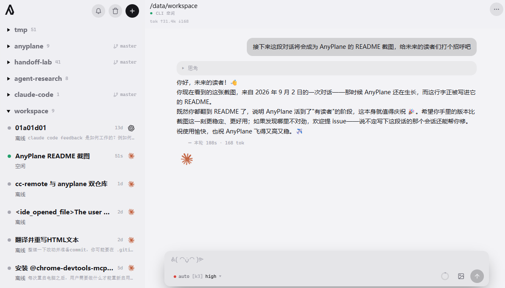

<p align="center">
  
</p>

# AnyPlane

> Run your agents, on any plane.

**Let your agents keep working while you go live your life. When one needs you, the approval is already waiting on your lock screen.**

> Looking for 简体中文？See [README.zh-CN.md](README.zh-CN.md).

**[anyplane.run](https://anyplane.run)** · npm: [`anyplane`](https://www.npmjs.com/package/anyplane) · [简体中文](README.zh-CN.md)

<p align="center">
  
</p>

AnyPlane is a self-hosted, vendor-neutral control plane for the coding agents already running on your machine. Open it from your phone or any browser to watch Claude Code and Codex sessions stream, approve the file writes and commands they ask for, and pick up conversations where you left them.

## Why this exists

The official remotes (Claude Code Remote Control, Codex remote) require a claude.ai subscription and route your session through the vendor. They are **unavailable** if you use an API key, an LLM gateway, Bedrock, Vertex, or Foundry — [and as of Claude Code v2.1.196, simply pointing `ANTHROPIC_BASE_URL` at a non-Anthropic host disables Remote Control entirely](https://code.claude.com/docs/en/remote-control).

AnyPlane is the control plane for everyone in that gap: no account, no relay, no telemetry. Your transcripts stay on your disk, your vendor tokens stay on your machine, and Claude Code and Codex share one interface.

## What you get

- **Watch agents from anywhere.** Streaming output, tool calls paired into cards, background sub-agents in a side panel — on a phone screen, over your LAN or your own tunnel.
- **Rule on approvals from the lock screen.** When an agent wants to write a file or run a command, a push notification carries a one-tap capability secret. On Android and desktop Chrome you approve or deny straight from the notification buttons. On iOS, where Safari ignores notification actions, the tap opens a two-button confirm page instead — either way you never load the full app.
- **Two runtimes, one interface.** Claude Code and Codex sessions are grouped by project directory and resumed with full context. The same gestures work on both.
- **Approval rules, not just afk/yolo.** Auto-allow or auto-deny by tool, command prefix, or working directory; everything else still asks. Every automatic ruling is broadcast and logged.
- **Notifications that actually reach you.** Web Push (VAPID and aes128gcm implemented in-house, no push SDK), plus ntfy, Bark and Server酱 webhook channels for environments where FCM isn't an option.
- **Rewind, branch, hand off.** Roll back a conversation or the files it touched, fork a session with its full history, or have one agent hand a summarized brief to another.

## How it works

AnyPlane does not patch or wrap the official CLIs. The server drives each vendor's own headless protocol as a subprocess — Claude Code over stream-json NDJSON (the same local protocol claude.ai/code uses to bridge your CLI), Codex over its app-server JSON-RPC. Codex events are translated server-side into the Claude stream-json message shape, so there is exactly one message boundary and the frontend never forks.

## Quick start

You need **Bun ≥ 1.4.0** and a logged-in official `claude` CLI on your PATH. The Codex backend additionally needs `codex` CLI ≥ 0.147.

```bash
bunx anyplane
```

Open <http://localhost:7480>. The frontend ships prebuilt in the npm package — no clone, no build step. Config and runtime data live in `~/.anyplane/`.

Don't have Bun? `npm i -g anyplane` and `npx anyplane` work too — they'll tell you how to install Bun if it's missing.

Running from source (Bun only — do not use npm / yarn / pnpm):

```bash
bun install
bun run build && bun run start   # production
bun run dev                      # server + Vite HMR
```

## Security

Running AnyPlane means exposing "start a session on this machine" to whoever can reach the port — and starting a session is equivalent to arbitrary command execution. Take the bind address seriously.

- Listens on `127.0.0.1` only by default.
- **Binding a non-loopback address (e.g. `0.0.0.0`) requires `authToken`**, or the server refuses to start.
- With a token configured, startup prints a QR code containing the tokenized URL — scan it from your phone.
- For access across networks, prefer Tailscale Funnel, Cloudflare Tunnel, or home IPv6 + DDNS over rolling your own ingress. All three recipes and their security tradeoffs are in [docs/public-access.md](docs/public-access.md).

## Configuration

`anyplane.config.json` in the project root or `~/.anyplane/config.json` — both optional.

```json
{
  "port": 7480,
  "host": "127.0.0.1",
  "authToken": "change-me",
  "permissionPolicy": "ask"
}
```

- `permissionPolicy`: `"ask"` (default, forwards approvals to the UI) or `"bypass"` (fully automatic — use with care).
- Push notifications require HTTPS or localhost. On iOS the site must be added to the Home Screen before it can subscribe.
- Full option reference, webhook channels and environment variables: [docs/configuration.md](docs/configuration.md). Domain access via the 80/443 gateway: [docs/gateway.md](docs/gateway.md).

## Known limitations

- Some features (`/btw`, goals) need Claude CLI ≥ 2.1.139.
- **iOS has never been tested on a real device.** The Web Push path degrades correctly by capability detection (confirm page when notification buttons are unavailable), but the author doesn't own an iPhone. If you try it — working or not — please open an issue.
- Rewind depends on file checkpoints: messages before a compact boundary can't be rewound, and Codex has no file checkpoints at all (conversation rewind and fork only).
- Codex doesn't persist reasoning; AnyPlane records it in a sidecar at `~/.anyplane/reasoning/`.
- `~/.anyplane/` is never cleaned automatically — it's yours to manage.
- **The UI is currently Simplified Chinese only.** i18n isn't in place yet; the interface is readable but not translated. This is the next thing on the list.

## Contributing

- Architecture decisions and working conventions: [AGENTS.md](AGENTS.md). Release process: [docs/releasing.md](docs/releasing.md).
- Long-form docs (research, planning, audits) live in `docs/` — see [docs/README.md](docs/README.md) for the map. Don't commit machine-specific paths or secret locations; use `*.local.md` (gitignored) if you must.
- End-to-end scripts are in `server/scripts/` and require a running server plus the real CLIs.
- Local mirrors of the vendor docs: `bun run docs:claude` / `bun run docs:codex`.

MIT. Formerly cc-remote.
